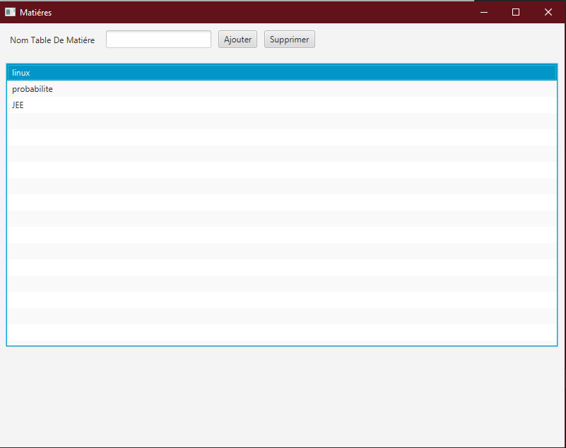
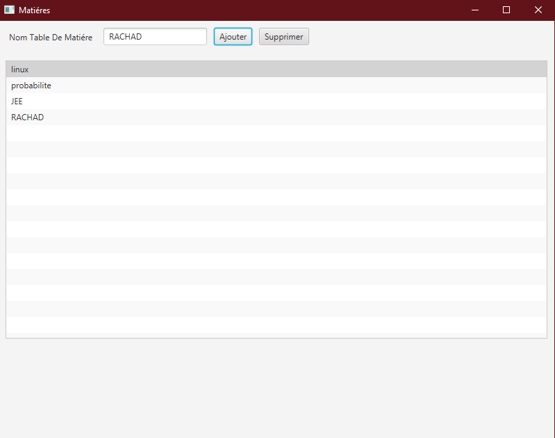
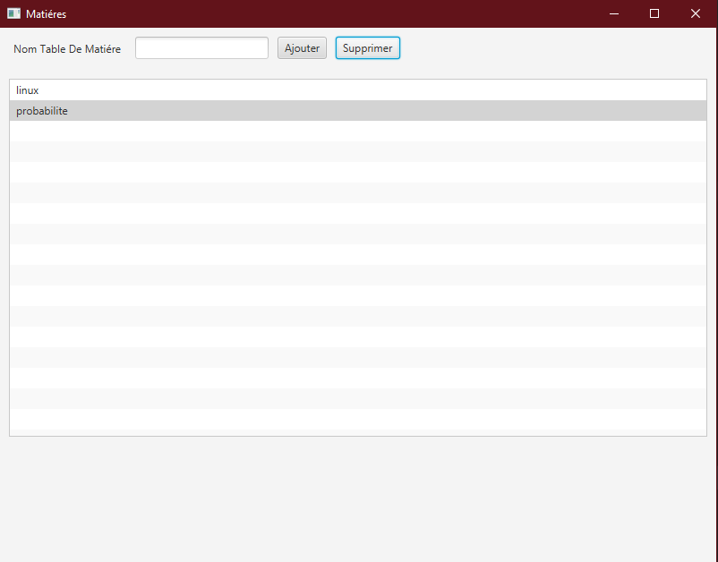

<h3>Application JavaFX</h3>
<h5>Le code fourni est une application JavaFX très simple qui permet à l'utilisateur de saisir des noms de matières dans un champ de texte, d'ajouter ces matières à une liste (ListView), et d'afficher la liste des matières ajoutées à l'utilisateur.</h5>
<h4>1. Interface General</h4>

<h4>2. Fonctionnalité D'Inssertion</h4>
<h5>Nous ajoutons un gestionnaire d'événements pour le bouton "Ajouter" à l'aide de la méthode setOnAction(). Ce gestionnaire d'événements est implémenté sous la forme d'une lambda expression qui récupère le texte saisi dans le champ de texte, l'ajoute à la liste des matières</h5>

<h4>3. Fonctionnalité De suppression</h4>
<h5>Ceci permet à l'utilisateur de supprimer un élément de la ListView en sélectionnant l'élément à supprimer et en cliquant sur le bouton "Supprimer". Si aucun élément n'est sélectionné, aucun élément ne sera supprimé de la ListView.</h5>
